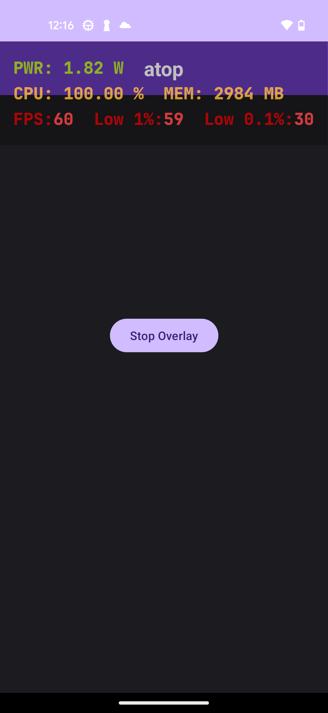
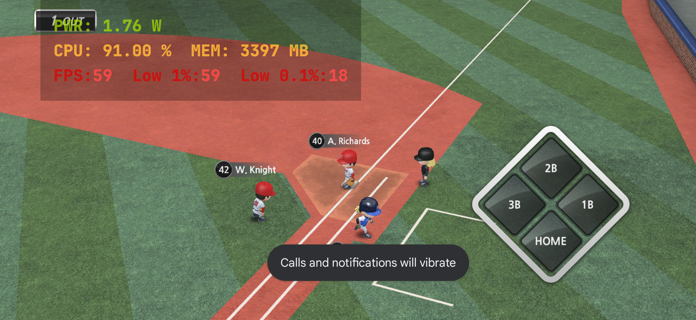

# atop

Performance monitoring overlay for android. 

## Features

* Non-interfering: overlay is not touch sensitive and does not interfere with the background applications
* Display metrics: 
  * Power draw: calculated from BatteryManager's current draw and approximate voltage derived from properties of lithium-oon batteries
  * Cpu utilization: approximation based on core frequencies, more accurate for sustained loads than burst loads
  * Memory utilization: calculated from ActivityManager's total memory and available memory metrics. Does not consider cached memory.
  * Current frames-per-second: calculated from Choreographer's frame callback timestamps over a period of time
  * Low 1% and Low 0.1% FPS: Calculated by recording the current FPS values since the overlay is launched and finding the 1 percentile and 0.1 percentile. 
* All monitoring is done in a low priority background thread to prevent the overlay from using significant resources and skewing the metrics
* Universal: support for all Android devices since API 24
* Minimal permissions: only overlay drawing permission is required. No root access is necessary.
* No persistence: no data is stored as disk read and write is expensive and will skew the metrics. Use external tools for recording the data. 

## Planned features:

* Customization options for the overlay including theme, color, transparency, size and position on screen.
* Play Store release

### On GPU utilization

While this is a key utilization metric for games and would be very nice to have, there is currently no way in Android to get GPU utilization metrics during app runtime. Vendors like Qualcomm provide tools (Snapdragon Profiler etc.) that can measure system and process GPU utilization but these tools are for development use only and require a computer. There is no API available for integration and measurement during runtime. 

## Acknowledgements
CPU utilization is calculated by adapting the algorithm from https://github.com/souch/AndroidCPU to Kotlin. 

